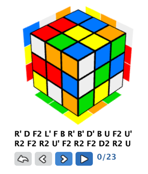

# REQUIREMENTS:
Give the Rubisk Cube, I neeed step by step instruction on how to solve it, the faster the better,
but speed is not an issues.

### USE CASE
We woul like to use like these:

- We open the app
- describe how my cube is now (scrambled!)
- when finished describing it, hit a button to show me the solution
- If I need another solution, repeat the process again.
- It woul be veru nice to show the solution visualy, if possible.

### WIREFRAME

Solve Screen
```
[ Logo ] Cube Solver

Inform here the initial state for yor cube: [ How? ]
[                         ]
[                         ]
[                         ]
[                         ]
[                         ]
[                         ]

[ Scramble ]

[ Solve ]

Solution:
[                         ]
[                         ]
[                         ]
[                         ]
[                         ]
[                         ]

[ Show ] => Show Screen

Instructions:

....
....
....

```
Show Screen
```
    Your solution has 23 steps
```

```    
    [movements notation]
    [colve a new one]

```


# ANALISYS AND DESIGN
Allways for existing solutions for the similar problems.
The time you spent in discovery you will save much more in development.
Searching the internet you can find a lot of stuff about fhis cube, from competiotion, to algorithims,
tutorials.
In our case, we are interested in how to solve. We find many tutorials, and how to describe the steps
Genetal information about Rubik's Cube
https://ruwix.com

Are there finished libraries to give you the steps to solve it?  YES!!!!!  many
we searched: "rubik code solution",  "rubik code solution in ruby", "rubik code solutionin javascript"
at the end we selected this ones as promisses:

https://github.com/chrishunt/rubiks-cube (ruby)
https://www.npmjs.com/package/cubejs (javascript)

### solutiion methods
https://rubikscu.be/#tutorial
https://ruwix.com/the-rubiks-cube/how-to-solve-the-rubiks-cube-beginners-method/step-1-first-layer-edges/

### JS to solve the cube
https://www.npmjs.com/package/cubejs

### Library to display the cube Movements
https://ruwix.com/widget/3d/?label=teste&alg=U R2 F' D' R U R2 F R B' L F2 U2 R2 D R2 U' R2 D F2 B2 D L2 F2&flags=showalg

### Gem wit a an easy two-cycle solution (DO NOT WORK!!!!)
https://github.com/chrishunt/rubiks-cube

Based on this, We can make a solution like this:

Create tha APP in ROR
One main screen to receive the cube description, send to a solution library and show the solution on the same screen
(1 controller: cube, 1 action: setup, 1 model:cube)
Another screen to show the solution animation, there is a 3D widget to display the solution:
https://ruwix.com/widget/3d/?label=teste&alg=U R2 F' D' R U R2 F R B' L F2 U2 R2 D R2 U' R2 D F2 B2 D L2 F2&flags=showalg


# IMPLEMENTATION

Using ROR this implementation is very straigh forward

    rails new mycube
    rake db:setup
    rails s

    rails g model MagicCube
    rails g controller Cube solve show


Start by your Views:

Solve
Here we will receive the input from the user and call the cube solver 
using javascript, as defined in the wireframe
[app/views/cube/solve.html.erb]
 
Show
we in include the cube 3D widget that will display the 
cube and animate its solution
[app/views/cube/solve.html.erb]

The cube controller
[app/controllers/cube_controller.erb]

Test it!

    rails s

### Solving the cube

    yarn add cubejs

in app/javascript/packs/application.js
add this code to create cube state sample [scramble]
and solve the provided cube and display the solution 
with the movements notation

```javascript
// using cubejs to solve the cube, linked to two buttons
const Cube = require('cubejs');
// This takes 4-5 seconds on a modern computer
Cube.initSolver();

function solveCube(colorString) {
    var faceString = color_to_face(colorString)
    let cube = Cube.fromString(faceString);
    let solution = cube.solve(50)
    return solution
}

function color_to_face(color_string) {
    const conv = {"W": "D", "O": "B", "R": "F", "G": "R", "Y": "U", "B": "L"};
    let face_string = "";
    color_string.split('').forEach(function(c) {
        face_string = face_string + conv[c]
    })
    return face_string
}

function face_to_color(face_string) {
    const conv = {"F": "R", "R": "G", "L": "B", "U": "Y", "B": "O", "D": "W"};
    let color_string = "";
    face_string.split('').forEach(function(c) {
        color_string = color_string + conv[c]
    })
    return color_string
}

addEventListener("turbolinks:load", function (_event) {
    $("#btn_scramble").click(function(){
        let cube = Cube.random()
        let faceString = cube.asString()
        let colorString = face_to_color(faceString)
        $('#initial_state').val(colorString)
    });
    $("#btn_solve").click(function(){
        if ($('#initial_state').length > 0) {
            let initialState = $('#initial_state').val()
            initialState = initialState.replace(/\s/g, '')
            initialState = initialState.replace(/\n/g, '')
            let solution = solveCube(initialState)
            $('#solution').val(solution)
        }
    })
})

```

Test it!

# Automated Test

Lets creata an automated test providng this cube state

    BBORYYRGBWBGWGBGYWWOORRBYWOGGYGWOBOGOWBRBYRYRWOYROGRWY

and expected result should be

    R' D F2 L' F B R' B' D' B U F2 U' R2 F2 R2 U' F2 R2 F2 D2 R2 U

and we expect to show the cube image on the show screen


To create such test we will use 

# Deploy

To deploy to heroku, create your account there and install the heroku client
    
```terminal
    heroku create
    git push heroku master
    heroku run rake db:migrate   
```

Visit your app
```terminal
    heroku open    
```


