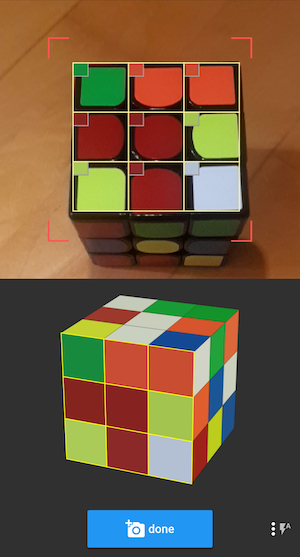

# Software Development Roles and Practices (or How to solve the Rubik's cube)

Software development is not just coding, like many may think (just update your code to do this, and it is done! 😩)
It involves many roles and practices in the complete development process if you want to avoid common software issues.

We will develop an application to solve Rubik's code using all the practices defined in a formal software development process (OPEN UP) 
and show why all roles are needed to create maintainable and usable software.

All these roles and practices are needed in any software development process (SCRUM, KANBAN...).
The same person can perform different roles, but you must seek the role's objectives while acting in any role.
To make a clear relationship between this presentation and the OPEN UP, we will follow their terminology.


Software development is a team process. Sorry coders, you are just 20% off the business 😁

# The Project

Let's start our project, we will skip the Project Manager Role and focus on
the development part only. We will start with the Analyst who received a request
to solve the Rubik's cube from a very strategic customer ASAP!

## Role: Analyst


Given the Rubik Cube, we need a web application that provide the user step-by-step instructions on how to solve it. 
The faster, the better, but speed is not an issue. No need to teach how to solve, just to provide the solution.

As an Analyst, I always look for existing solutions for similar problems, specially when I suspect I am not the only one with a similar problem.
The time you spent in discovery, is a well spent time, we will save much more in the later development.

Searching the internet, you can find a lot of stuff about the cube, tutorials, competitions, movement's notation, algorithms...,
In our case, we are interested in how to solve. We find a very complete site about is at https://ruwix.com which I used a main reference.

We also found this very nice app that does exactly what we need!

[](https://youtu.be/XRHKbgQ0Dj0)

*Disclaimer: Any coincidence with features, screens, or use cases was pure similarity*

### USE CASE
Understanding the problem, we defined along with the customer how this app should look like and defined
the following use case for it:

- We open the app
- describe how my cube is now (color disposition on each face)
- when finished describing it, hit a button to show me the solution in the same page
- If I need another solution, repeat the process.
- It would be very nice to show the solution visually in a 3D animation, if possible.

### WIREFRAME
After a lot of research ans considering some contraints of knowledge and time, we defined a simpler solution:


## Role: Architect


### Envision the Architecture

The problem is very clearly defined, so we nedd to find the most effective way to provide this app.

### How to solve the cube
There are many options, form the simplest to more complex ones. Here are some:
- https://rubikscu.be/#tutorial
- https://ruwix.com/the-rubiks-cube/how-to-solve-the-rubiks-cube-beginners-method/step-1-first-layer-edges/

To make our own algorithim to solve it will be very difficult and time consuming, and for sure someone else has already did that.
We are interested in existing libraries that provide all the steps to solve a Rubik's cube, there must be ready a solution for it.
We searched: "Rubik code solution",  "Rubik code solution in ruby", "Rubik code solution in javascript".
In the end, we foud these options:

## Automated solutions
We searched for automated solutions in any language, we found many and selected these ones:

### Gem wit a an easy two-cycle solution
In our tests, tt generates too many stesp (+400) or do not return at all.
It was our first option, since it is a gem and our app is in Rails, but we discarded it.
https://github.com/chrishunt/rubiks-cube

### JS to solve the cube
Very fast, fewer movements ~25 for any state. Lets use it!
https://www.npmjs.com/package/cubejs

### Library to display the cube Movements
Very nice and easy to use 3D widget created and used by Ruwik site everywhere.

[Example](https://ruwix.com/widget/3d/?label=teste&alg=U%20R2%20F%27%20D%27%20R%20U%20R2%20F%20R%20B%27%20L%20F2%20U2%20R2%20D%20R2%20U%27%20R2%20D%20F2%20B2%20D%20L2%20F2&flags=showalg)

After the research, we decide how to make it with our familiar tools:

## Refine the Architecture

- Create the APP in ROR: One main screen to receive the cube description, send to a solution library, and show the solution on the same screen.
(1 controller: cube, 1 action: setup, 1 model:cube)
- Use the RUBJS javascript component to solve the cube: The cube description must follow the guideline defined by the CUBEJS solver
- On another screen show the solution animation, Using the 3D widget to display the found solution.
- For demonstration we host and deploy the application on Heroku in a free account


### Obs:
The analyst/Architecure tasks are very linked, we may change the desired outcome base on the 
available technology or resources, so its very common to both work together in many interactions 
until you get a satisfactory solution for business and technology.


(slides from Chris Alvarez’s presentation about Design)

# Role: Developer


Using ROR this implementation is very straigh forward

```bash
rails new cube --database=postgresql
rake db:setup
rails s
```

To have these two screens we need a controller with two actions: solve and show

```bash
rails g controller Cube solve show
```

Config root to be the solve screen. add this line to routes.rb
```ruby
root to: 'cube#solve'
```

The cube controller has these 2 actions:

[controller source code](https://github.com/jlneto/cube/blob/master/app/controllers/cube_controller.rb)

```ruby
class CubeController < ApplicationController
  def solve
    @initial_state = params[:initial_state] || 'YOWBYBYBOYRRYGROBWGOBRROYWWOGBRWWGOORYRYBYRGGBGBWOGGWW'
    @solution = params[:solution]
  end
  def show
    @solution = params[:solution]
    @steps = @solution.split(' ').count if @solution
    @cube_params = "alg=#{@solution}|flags=showalg"
  end
end
```

## Build the Views

The Solve action we will receive the input from the user and call the cube solver 
using javascript, as defined in the wireframe

[solve source code](https://github.com/jlneto/cube/blob/master/app/views/cube/solve.html.erb)
 
The Show action we will show the cube 3D widget that will display the 
cube and animate its solution

[show source code](https://github.com/jlneto/cube/blob/master/app/views/cube/show.html.erb)

add the logo image to the images folder app/assets/images we are using in the layout

    rubik-cube.svg

[show source code](https://github.com/jlneto/cube/blob/master/app/views/layouts/application.html.erb)


Test it!

```bash
rails s
```

### Displaying the cube solution

Add the jquery libraries needed:

```html
    <script src="https://ajax.googleapis.com/ajax/libs/jquery/3.1.1/jquery.min.js"></script>
    <%= javascript_include_tag "roofpig_and_three.min", 'data-turbolinks-track': 'reload' %>
```

add some css to display the cube solver in app/assets/stylesheets/cube.css

```css
// Place all the styles related to the cube controller here.
// They will automatically be included in application.css.
// You can use Sass (SCSS) here: https://sass-lang.com/
/*Roofpig BEGIN*/
.roofpig:before,.roofpig:after{content:" ";display:table}
.roofpig:after{clear:both}
.roofpig{border:none !important;margin:5px auto 25px;max-width:500px;color:#000;font-weight:bold;font-size:1.1em}
.roofpig.inlineblock{margin:5px 20px 25px;vertical-align:top}
.roofpig > div{height:auto !important;border:none !important;margin-top:5px}
.roofpig-algtext{background-color:transparent;height:auto !important;font-size:15px !important;line-height:19px;font-weight:bold;text-align:left;margin-bottom:7px}
.roofpig-past-algtext{background-color:#a9cef5;border-radius:5px}
.roofpig-button{border-radius:5px;border:none;font-weight:bold;line-height:22px;height:27px !important;margin-right:6px;text-indent:-117px;font-size:10px !important;overflow:hidden;width:34px !important}
.width150 .roofpig-button{width:30px !important}
.roofpig-count{font-weight:bold;color:#2e649e;width:auto;margin-left:2px;display:inline-block}
.width100{width:100px}
.width150{width:150px}
.width200{width:200px}
.width250{max-width:250px}
.width300{max-width:300px}
.width350{max-width:350px}
.width400{max-width:400px}
.width450{max-width:450px}
.width500{max-width:500px}
.widget-container{margin:0 0 30px}
#rightSidebarContent{padding:30px}
#play-1{animation:firstPlayButtonBlinking 5s infinite}
@keyframes firstPlayButtonBlinking{0%{background-color:#4287d2; }
  70%{background-color:#4287d2; }
  80%{background-color:#EEEEEE; }
  90%{background-color:#f5111b; }
  100%{background-color:#4287d2; }
}
.roofpig-help-button{display:none}
/*Roofpig END*/
```

You may receive this error:
```ruby
Sprockets::Rails::Helper::AssetNotPrecompiled in Cube#solve
```

To solve this, add this line to config initilizer config/initializers/assets.rb

```ruby
Rails.application.config.assets.precompile += %w(roofpig_and_three.min.js)
```


### Solving the cube

```bash
yarn add cubejs
```


in app/javascript/packs/application.js
add this code to create cube state sample [scramble]
and solve the provided cube and display the solution 
with the movements notation

[application.js](https://github.com/jlneto/cube/blob/master/app/javascript/packs/application.js)

```javascript
// using cubejs to solve the cube, linked to two buttons
const Cube = require('cubejs');
// This takes 4-5 seconds on a modern computer
Cube.initSolver();

function solveCube(colorString) {
    var faceString = color_to_face(colorString)
    let cube = Cube.fromString(faceString);
    let solution = cube.solve(50)
    return solution
}

function color_to_face(color_string) {
    const conv = {"W": "D", "O": "B", "R": "F", "G": "R", "Y": "U", "B": "L"};
    let face_string = "";
    color_string.split('').forEach(function(c) {
        face_string = face_string + conv[c]
    })
    return face_string
}

function face_to_color(face_string) {
    const conv = {"F": "R", "R": "G", "L": "B", "U": "Y", "B": "O", "D": "W"};
    let color_string = "";
    face_string.split('').forEach(function(c) {
        color_string = color_string + conv[c]
    })
    return color_string
}

addEventListener("turbolinks:load", function (_event) {
    $("#btn_scramble").click(function(){
        let cube = Cube.random()
        let faceString = cube.asString()
        let colorString = face_to_color(faceString)
        $('#initial_state').val(colorString)
    });
    $("#btn_solve").click(function(){
        if ($('#initial_state').length > 0) {
            let initialState = $('#initial_state').val()
            initialState = initialState.replace(/\s/g, '')
            initialState = initialState.replace(/\n/g, '')
            let solution = solveCube(initialState)
            $('#solution').val(solution)
        }
    })
})
```

### Eat your own dog food!
Run you application until it is good enough to show to others!
```bash
rails s
```

# Role: Tester


Lets creata an automated test providng this cube state

    BBORYYRGBWBGWGBGYWWOORRBYWOGGYGWOBOGOWBRBYRYRWOYROGRWY

and expected result should be

    R' D F2 L' F B R' B' D' B U F2 U' R2 F2 R2 U' F2 R2 F2 D2 R2 U

and we expect to show the cube image on the show screen exactly like defined in the fists page.
after all movement the cube must be solved.

First we run it manually!


```bash
rails s
```

To create such test we will use Capybara to reproduce the use case defined in it's DSL.
Add these lines to the [Gemfile](https://github.com/jlneto/cube/blob/master/Gemfile)

```ruby
group :development, :test do
  # Call 'byebug' anywhere in the code to stop execution and get a debugger console
  ...
  gem 'rspec-rails'
end
```
run these commands:
```bash
bundle install
rails generate rspec:install
```

add the following lines to [rails_helper.rb](https://github.com/jlneto/cube/blob/master/spec/rails_helper.rb)

```ruby
require 'capybara'
require 'capybara/rspec'
require 'webdrivers'
require 'capybara/rails'
```
Make sure rspec is working

```bash
rspec
```

Write the following test in rspec/features/solve_spec.rb

[solve_spec.rb](https://github.com/jlneto/cube/blob/master/spec/features/solve_spec.rb)
```ruby
require 'rails_helper'

RSpec.describe "solve the cube", type: :feature, js: true do

	it "should solve a cube" do
		visit root_path
		fill_in 'initial_state', with: 'BBORYYRGBWBGWGBGYWWOORRBYWOGGYGWOBOGOWBRBYRYRWOYROGRWY'
		click_button 'btn_solve'
		expect(page).to have_field('solution', with: "R' D F2 L' F B R' B' D' B U F2 U' R2 F2 R2 U' F2 R2 F2 D2 R2 U")
		click_button 'btn_show'
		expect(page).to have_content('Your solution has 23 steps')
	end

end
```
Run the test!

```bash
rspec
```


# Role: Deployment Engineer


If the app is working fine, all automated tests are ok, time to deploy to production, and the more automated the better.
We will deploy it to heroku as an example. Create your account there and install the heroku client if you alreay do not have it.
    
After that, run the following commands:

```bash
    heroku create
    git push heroku master
```
Heroku will deploy your app automatically as soon as it is commited to it's repository.
If it is deployed correctly. Visit your app

```bash
    heroku open    
```
or you can see an example [here](https://mighty-gorge-83383.herokuapp.com)


### Other Roles

We did not cover all the roles, just the main ones, but you have all roles in the Open Up process.


# REFERENCES

- https://www.ibm.com/developerworks/rational/library/content/03July/1000/1251/1251_bestpractices_TP026B.pdf
- https://en.wikipedia.org/wiki/Rational_Unified_Process
- https://www.eclipse.org/epf/
- https://www.eclipse.org/downloads/download.php?file=/technology/epf/PracticesLibrary/published/epf_practices_published_1.5.1.5_20121212.zip
- https://www.eclipse.org/downloads/download.php?file=/technology/epf/OpenUP/published/openup_published_1.5.1.5_20121212.zip
- https://medium.com/@LucianeS/openup-um-processo-integrado-e-agil-a4400c17ce62
- https://github.com/ldez/cubejs
- http://kociemba.org/cube.htm
- https://stackoverflow.com/questions/44556692/javascript-get-average-color-from-a-certain-area-of-an-image/44557266
- https://medium.com/swlh/detect-color-objects-with-tracking-js-623a15b14732
  
  